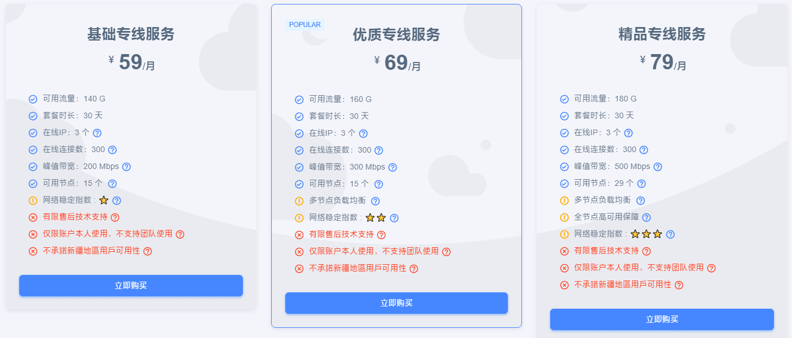
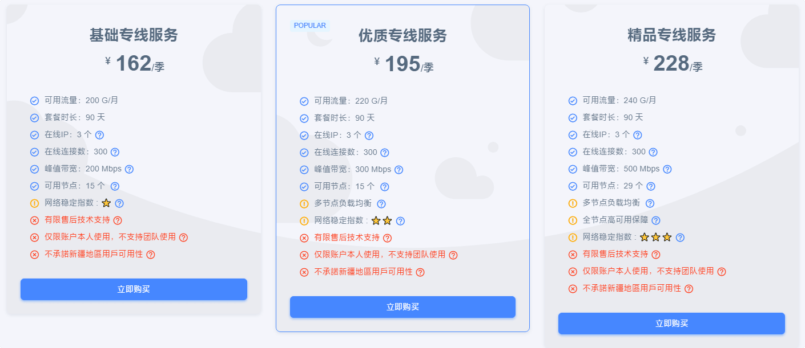
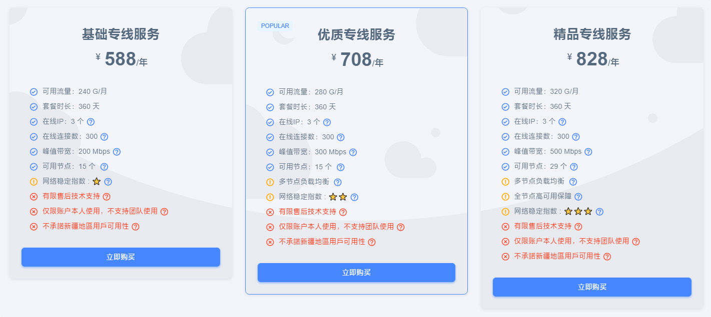

# wgetcloud官网最新地址

wgetcloud官网最新地址：[wgetcloud.org](https://invite.wgetcloud.ltd/auth/register?code=wbN8lk)

## 简介

WgetCloud （原 GaCloud） 已经稳定运行多年，多线BGP中转+双程CN2优质线路，高峰期也可以稳定可用。支持使用支付宝、USDT 加密货币等付款。

WgetCloud 节点支持 Shadowsocks、SSR、V2ray、Trojan 等协议，并且支持所有主流代理软件app订阅格式——Clash、Shadowrocket、Quantumult X、Surge……对线路节点采取分组制，单组用户人数满400后便不会增加人数，加上对节点采取了动态限速，有效保证线路稳定行。

---

**温馨提示：任何服务均有跑路风险，请自行注意防范！**

**本页面仅分享网络信息，不做推荐，有问题请自行联系服务商处理！**

---

## wgetcloud优惠券

新用户即享85折体验，注册成功自动领取，可前往福利中心查看优惠券！

首次购买套餐新用户，可额外领取一张7天奈飞体验卡。

🛒 活动一：活动商店

👉 活动详情：在活动期间，您可以访问【活动商店】选购限量优惠流量包。

🛍️ 活动二：礼包商店

👉 活动详情：在活动期限内，您可前往【礼包商店】选购抵扣券礼包。

## WgetCloud特色

* 香港、台湾、新加坡、日本、美国节点
* 多节点负载均衡
* 全节点SLA保障（精品专线）

## WgetCloud套餐列表

**年付比月付多一倍流量 更划算**

基础专线

<ul>
<li>月付：￥59/月，140G流量/月。</li>
<li>季付：￥162/季，200G流量/月。</li>
<li>年付：￥588/年，240G流量/月。</li>
</ul>

优质专线

<ul>
<li>月付：￥69/月，160G流量/月。</li>
<li>季付：￥195/季，220G流量/月。</li>
<li>年付：￥708/年，280G流量/月。</li>
</ul>

精品专线

<ul>
<li>月付：￥79/月，180G流量/月。</li>
<li>季付：￥228/季，240G流量/月。</li>
<li>年付：￥828/年，320G流量/月。</li>
</ul>

---

**温馨提示：任何服务均有跑路风险，请自行注意防范！**

**本页面仅分享网络信息，不做推荐，有问题请自行联系服务商处理！**

---
